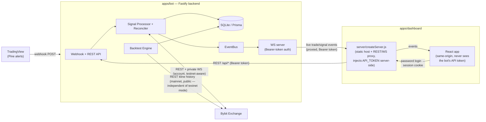

# crypto-bot

TradingView → Webhook → Bybit Futures trading bot with a React dashboard.

**Stack:** Node.js + TypeScript + Fastify · SQLite + Prisma · React + Vite + TailwindCSS · bybit-api SDK

## Structure

```
apps/
  bot/          Fastify backend — webhook receiver, order execution, position tracking
  dashboard/    React frontend — live P&L, trade history, position monitor
packages/
  eslint-config Shared ESLint rules
```

## Architecture

High-level view of how the pieces connect. See [`apps/bot/README.md`](apps/bot/README.md) and
[`apps/dashboard/README.md`](apps/dashboard/README.md) for detailed internal diagrams of each app.



> In local dev, the React app talks directly to the bot with a dev token (no proxy) for
> convenience — see `apps/dashboard/README.md`. The diagram above is the production path.

> **Keeping this in sync:** whenever a feature or bug fix changes how these pieces connect,
> update this diagram (and the per-app ones) as part of that change — see `CLAUDE.md`.

## Prerequisites

- Node.js ≥ 20
- npm ≥ 10 (workspaces support)

## Setup

```bash
# 1. Install all dependencies
npm install

# 2. Copy and fill in env files
cp apps/bot/.env.example apps/bot/.env
cp apps/dashboard/.env.example apps/dashboard/.env
cp apps/dashboard/.env.development.example apps/dashboard/.env.development

# 3. Start both apps in dev mode
npm run dev
```

The bot starts on **http://localhost:3000** and the dashboard on **http://localhost:5173**.

## Scripts

| Command | Description |
|---------|-------------|
| `npm run dev` | Start both apps with hot-reload |
| `npm run build` | Compile both apps for production |
| `npm run lint` | Run ESLint across both apps |
| `npm run test` | Run bot unit tests (Vitest) |
| `npm run format` | Auto-format with Prettier |

**Bot-specific scripts:**

| Command | Description |
|---------|-------------|
| `npm run check-bybit --workspace apps/bot` | Verify Bybit API connectivity, balance, and positions |
| `npm run reset-trade-data --workspace apps/bot` | Dry-run: show how many trades/signals would be wiped |
| `npm run reset-trade-data --workspace apps/bot -- --confirm` | Wipe all trades and signals on the deployed bot (preserves bots and balance history) |

## Bot modes

Each bot row in the database has a `dryRun` flag that controls how signals are executed:

| Mode | `dryRun` | `BYBIT_TESTNET` | What happens |
|------|----------|-----------------|--------------|
| **Dry-run** | `true` | any | Signal processed, fake trade recorded in DB, **no order sent to Bybit** |
| **Testnet** | `false` | `true` | Real order placed on Bybit **testnet** (fake money, real API) |
| **Live** | `false` | `false` | Real order placed on Bybit **live** (real money) |

**Recommended progression:**
1. Start with `dryRun: true` — verify the full TradingView → webhook → dashboard pipeline works
2. Switch to `dryRun: false` + `BYBIT_TESTNET=true` — watch real testnet orders appear in your Bybit account
3. Only set `BYBIT_TESTNET=false` when you're confident everything is working correctly

## Environment variables

| File | Purpose | Committed? |
|------|---------|-----------|
| `apps/bot/.env` | Local dev — testnet keys, local DB, dev token | No |
| `apps/bot/.env.production` | Production scripts — Railway URL + prod API token | No |
| `apps/dashboard/.env` | Local dev — points dashboard at localhost bot | No |

See `apps/bot/.env.example` and `apps/dashboard/.env.example` for full documentation of every variable.

### Setting up `.env.production`

Required before running any script that targets the deployed Railway service:

```bash
# 1. Get your production API token from Railway
railway run --service service-exchange-bot -- printenv API_TOKEN

# 2. Create the file (it's gitignored)
cat > apps/bot/.env.production << EOF
BOT_URL=https://your-service.up.railway.app
API_TOKEN=<paste token here>
EOF
```
