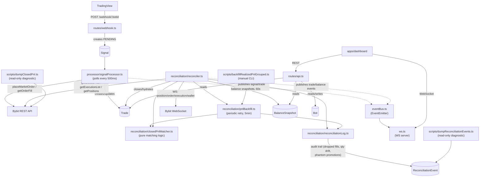

# apps/bot

Fastify backend: receives TradingView webhook alerts, executes orders on Bybit, tracks positions/trades in SQLite, and reconciles state against the exchange.

See the [root README](../../README.md) for the system-wide diagram and setup instructions. This doc covers the bot's internal structure.

## Architecture

## Signal → Trade lifecycle

1. **Webhook** (`routes/webhook.ts`) validates a TradingView alert against the bot's `webhookId`/symbol and stores it as a `Signal` row with `status: PENDING`.
2. **SignalProcessor** (`processor/signalProcessor.ts`) polls for the oldest `PENDING` signal every 500ms. For an entry, it places a market order via `exchange/bybit.ts`, creates a `Trade` row immediately (before any enrichment call, so a placed order is never orphaned), then best-effort corrects `qty`/`entryPrice` from `getOrderFill` (which waits for a terminal order status before returning — see `bybit.ts`). For an opposite-side signal, it first places a reduce-only close order and marks the existing trade(s) `CLOSING`.
3. **Reconciler** (`reconciliation/reconciler.ts`) subscribes to Bybit's private WebSocket (`position`/`order`/`execution`/`wallet` topics):
   - An `order` fill event either hydrates an opening trade's real fill price/qty, or (if `reduceOnly`) closes the matching trade(s) with Bybit's authoritative `closedPnl`. If the fill can't find a matching `OPEN`/`CLOSING` trade (e.g. it was already closed), the fill is dropped and logged as a `FILL_DROPPED` reconciliation event.
   - A `position` size-0 event sweeps any remaining `OPEN`/`CLOSING` trades for that symbol via `closeRemainingOpenTrades` — tries `getClosedPnL` first (via the shared `closedPnlMatcher`), then `getExecutionList` as a local-formula fallback (`pnlSource: EXEC_FALLBACK`). It never decides `PHANTOM` itself (Bybit's data can lag a just-closed position by minutes, so an immediate decision risks zeroing out a real trade) — see the periodic sweep below.
   - A periodic sweep (every 60s, `runReconciliation`) checks live Bybit positions against `OPEN`/`CLOSING` trades for mismatches.
   - A separate periodic sweep (every 5min, `runPnlBackfill` → `pnlBackfill.ts`) retries `EXEC_FALLBACK`/null-source trades closed in the last 48h — closing the gap left by the one-shot live attempt above. A single-row trade held under 5s with still no Bybit evidence after a 15-minute grace period is promoted to `PHANTOM` here, once we're confident it's not just indexing lag.
   - Notable anomalies (dropped fills, qty drift, phantom promotions, unmatched lookups) are persisted to `ReconciliationEvent` via `reconciliation/reconciliationLog.ts`, since console logs don't survive Railway's log retention window — query them with `npm run dump:reconciliation-events`.
4. **Dashboard** reads trade/equity/position state via `routes/api.ts` (REST) and receives live updates over `ws.ts`'s WebSocket server, fed by the internal `eventBus.ts`.

## Manual scripts

| Script | Purpose |
|---|---|
| `npm run backfill:pnl-grouped -- --dry-run` | Re-run the PnL matcher against historical `EXEC_FALLBACK`/null trades; `--allow-qty-fix` also corrects a mismatched `qty` (see script header for details) |
| `npm run dump:closed-pnl -- --symbol X --from ISO --to ISO` | Read-only: print raw Bybit `getClosedPnL` entries next to matching DB trades, for manual reconciliation |
| `npm run dump:reconciliation-events -- --type X --symbol Y` | Read-only: print persisted anomaly events (dropped fills, qty drift, phantom promotions) — the audit trail that survives after logs are gone |
| `npm run repair:history` | Clean up bad balance snapshots and inflated PnL rows |
| `npm run mark-phantoms` | Mark trades with no corresponding Bybit record as `PHANTOM` |
| `npm run check-bybit` | Verify Bybit API connectivity, balance, and positions |
| `npm run reset-trade-data` | Wipe trades/signals on the deployed bot (see root README) |
