# apps/bot

Fastify backend: receives TradingView webhook alerts, executes orders on Bybit, tracks positions/trades in SQLite, and reconciles state against the exchange.

See the [root README](../../README.md) for the system-wide diagram and setup instructions. This doc covers the bot's internal structure.

## Architecture

```mermaid
graph TB
    TV["TradingView"] -->|"POST /webhook/:botId"| WH["routes/webhook.ts"]
    WH -->|creates PENDING| SIGNAL[("Signal")]

    SIGNAL --> SP["processor/signalProcessor.ts<br/>(polls every 500ms)"]
    SP -->|placeMarketOrder / getOrderFill| BYBIT_REST["Bybit REST API<br/>(account-scoped, testnet-aware)"]
    SP -->|creates/updates| TRADE[("Trade")]
    SP -. "publishes signal/trade events" .-> BUS

    REC["reconciliation/reconciler.ts"] -->|"WS: position/order/execution/wallet"| BYBIT_WS["Bybit WebSocket"]
    REC -->|"getClosedPnL / getExecutionList / getPositions"| BYBIT_REST
    REC -->|closes/hydrates| TRADE
    REC --> PNLB["reconciliation/pnlBackfill.ts<br/>(periodic retry, 5min)"]
    PNLB --> MATCHER["reconciliation/closedPnlMatcher.ts<br/>(pure matching logic)"]
    REC --> MATCHER
    REC -->|balance snapshots, 60s| SNAP[("BalanceSnapshot")]
    REC -. "publishes trade/balance events" .-> BUS
    REC --> RLOG["reconciliation/reconciliationLog.ts"]
    PNLB --> RLOG
    RLOG -->|"audit trail (dropped fills, qty drift,<br/>phantom promotions)"| REVENT[("ReconciliationEvent")]

    API["routes/api.ts"] -->|reads| TRADE
    API -->|reads| SNAP
    API -->|reads/writes| BOT[("Bot")]

    BUS["eventBus.ts<br/>(EventEmitter)"] --> WSS["ws.ts<br/>(WS server)"]
    BUS --> NOTIFIER["notifications/notifier.ts<br/>(Telegram)"]

    STORAGEMON["storage/storageMonitor.ts<br/>(periodic, 6h)"] -->|getStorageStats| CANDLE
    STORAGEMON -->|getStorageStats| FUNDING
    STORAGEMON -. "publishes storage.critical<br/>(24h cooldown)" .-> BUS
    STORAGEAPI["storage/storageRoutes.ts<br/>(GET stats, DELETE candles)"] -->|reads/prunes| CANDLE
    STORAGEAPI -->|reads/prunes| FUNDING
    DASH -->|REST| STORAGEAPI

    DASH["apps/dashboard"] -->|REST| API
    DASH -->|WebSocket| WSS

    CLI["scripts/backfillRealizedPnlGrouped.ts<br/>(manual CLI)"] --> PNLB
    DIAG["scripts/dumpClosedPnl.ts<br/>(read-only diagnostic)"] --> BYBIT_REST
    DIAG2["scripts/dumpReconciliationEvents.ts<br/>(read-only diagnostic)"] --> REVENT

    BTAPI["backtest/backtestRoutes.ts<br/>(GET strategies, POST run, POST optimize,<br/>POST/GET optimize/auto(+cancel/delete),<br/>GET candles, POST :id/pine)"] -->|ensureCandles| CSTORE["backtest/candleStore.ts"]
    CSTORE -->|"getKline (missing ranges only)"| BYBIT_MAINNET["Bybit REST API<br/>(mainnet, public — always real prices,<br/>independent of BYBIT_TESTNET)"]
    CSTORE -->|upsert/read| CANDLE[("Candle")]
    BTAPI -->|ensureFundingRates| FSTORE["backtest/fundingStore.ts"]
    FSTORE -->|"getFundingHistory (missing ranges only)"| BYBIT_MAINNET
    FSTORE -->|upsert/read| FUNDING[("FundingRate")]
    BTAPI -->|"strategy.run(candles, params)"| STRAT["backtest/strategies/*.ts<br/>(Pine-mirrored presets, composable<br/>customMaCross, bbMeanReversion scalper)"]
    STRAT -->|toPine| PINEGEN["backtest/strategies/pineExport.ts"]

    BTAPI -->|"runFull / runStats<br/>(per-request pool)"| POOL["backtest/workerPool.ts<br/>(fixed worker_thread pool —<br/>keeps every backtest off this<br/>process's event loop)"]
    POOL -->|"pack once per candle array,<br/>share by reference"| CBUF["backtest/candleBuffer.ts<br/>(columnar SharedArrayBuffer)"]
    POOL -->|postMessage task| WORKER["backtest/backtestWorker.ts<br/>(worker_thread — unpacks candles,<br/>runs strategy.run + engine + stats,<br/>optionally scoreResult)"]
    WORKER -->|runOneBacktest| OPT["backtest/optimizer.ts<br/>(param-sweep + shared run helper)"]
    OPT -->|runBacktestEngine| ENGINE["backtest/engine.ts<br/>(reuses calcQty/roundToTick;<br/>accrues funding, approximates<br/>liquidation, intrabar drawdown)"]
    ENGINE --> STATS["backtest/stats.ts"]
    WORKER -.->|"scoreResult (score-kind tasks)"| SCORING["backtest/scoring.ts<br/>(Sharpe/Calmar + risk-adjusted<br/>composite score, not raw PnL)"]

    BTAPI -->|"detached, single-job lock"| RUNNER["backtest/optimizationRunner.ts<br/>(Strategy Finder background job:<br/>iterates strategy x symbol x timeframe,<br/>one pool for the whole run)"]
    RUNNER -->|ensureCandles| CSTORE
    RUNNER -->|ensureFundingRates| FSTORE
    RUNNER -->|"searchCell (pool in opts)"| SEARCH["backtest/search.ts<br/>(coarse grid → refine, LHS sampling,<br/>train/validate/holdout split,<br/>optional walk-forward folds)"]
    SEARCH -->|runScored, dispatched concurrently| POOL
    RUNNER -->|"progress + bounded top-N results"| OPTRUN[("OptimizationRun")]
    DASH -->|REST| BTAPI
```

`backtest/workerPool.ts` replaced running backtests synchronously inline in `backtestRoutes.ts` and
`optimizationRunner.ts` — this process also runs live trading (`SignalProcessor` polling every
500ms, `Reconciler` ticking every 500ms-60s), so a large `/run` or `/optimize` sweep used to be
able to stall webhook ingestion and reconciliation for as long as it took, and risk a Railway
healthcheck restart mid-position. A pool is created per operation (one `/run` request, one
`/optimize` sweep, one Strategy Finder run) and destroyed when it completes. Candle data reaches
worker threads via a columnar `SharedArrayBuffer` (`candleBuffer.ts`) rather than being
structurally cloned per task — packed once per distinct candle array, then reused (each worker
unpacks and caches its own `Candle[]` view the first time it sees a given array). `search.ts`
falls back to its original in-process sequential path when no pool is supplied (e.g. in tests
using ad-hoc `StrategyDefinition` objects a worker thread couldn't resolve by id).

## Signal → Trade lifecycle

1. **Webhook** (`routes/webhook.ts`) validates a TradingView alert against the bot's `webhookId`/symbol and stores it as a `Signal` row with `status: PENDING`.
2. **SignalProcessor** (`processor/signalProcessor.ts`) polls for the oldest `PENDING` signal every 500ms. For an entry, it places a market order via `exchange/bybit.ts`, creates a `Trade` row immediately (before any enrichment call, so a placed order is never orphaned), then best-effort corrects `qty`/`entryPrice` from `getOrderFill` (which waits for a terminal order status before returning — see `bybit.ts`). For an opposite-side signal, it first places a reduce-only close order and marks the existing trade(s) `CLOSING`.
3. **Reconciler** (`reconciliation/reconciler.ts`) subscribes to Bybit's private WebSocket (`position`/`order`/`execution`/`wallet` topics):
   - An `order` fill event either hydrates an opening trade's real fill price/qty, or (if `reduceOnly`) closes the matching trade(s) with Bybit's authoritative `closedPnl`. If the fill can't find a matching `OPEN`/`CLOSING` trade (e.g. it was already closed), the fill is dropped and logged as a `FILL_DROPPED` reconciliation event.
   - A `position` size-0 event sweeps any remaining `OPEN`/`CLOSING` trades for that symbol via `closeRemainingOpenTrades` — tries `getClosedPnL` first (via the shared `closedPnlMatcher`), then `getExecutionList` as a local-formula fallback (`pnlSource: EXEC_FALLBACK`). It never decides `PHANTOM` itself (Bybit's data can lag a just-closed position by minutes, so an immediate decision risks zeroing out a real trade) — see the periodic sweep below.
   - A periodic sweep (every 60s, `runReconciliation`) checks live Bybit positions against `OPEN`/`CLOSING` trades for mismatches.
   - A separate periodic sweep (every 5min, `runPnlBackfill` → `pnlBackfill.ts`) retries `EXEC_FALLBACK`/null-source trades closed in the last 48h — closing the gap left by the one-shot live attempt above. A single-row trade held under 5s with still no Bybit evidence after a 15-minute grace period is promoted to `PHANTOM` here, once we're confident it's not just indexing lag.
   - Notable anomalies (dropped fills, qty drift, phantom promotions, unmatched lookups) are persisted to `ReconciliationEvent` via `reconciliation/reconciliationLog.ts`, since console logs don't survive Railway's log retention window — query them with `npm run dump:reconciliation-events`.
4. **Dashboard** reads trade/equity/position state via `routes/api.ts` (REST) and receives live updates over `ws.ts`'s WebSocket server, fed by the internal `eventBus.ts`.

## Strategy Finder (auto strategy/param search)

Brute-forcing every parameter combination for a strategy is infeasible (one strategy can have
enough numeric params at fine steps to produce billions of combos), and ranking by raw
in-sample profit reliably surfaces curve-fit configs that don't hold up live. `POST
/api/backtest/optimize/auto` starts a detached background job (`backtest/optimizationRunner.ts`)
instead of running inline in the request:

1. It iterates the requested `strategyIds x symbols x timeframes` matrix; each cell fetches
   candles via `ensureCandles` (cached after the first run) and calls `search.ts`'s
   `searchCell`.
2. `searchCell` builds a bounded **coarse grid** honoring each param's schema (enum params
   expand to their few discrete values; a `showIf`-gated param only varies in branches where
   its gate holds), scores every combo with `scoring.ts`'s risk-adjusted `scoreResult`
   (Sharpe/Calmar/profit-factor, not raw PnL%), then **refines** a finer grid around the best
   regions.
3. Candles are split into three chronological chunks up front — **train** (search optimizes
   here), **validate** (a shortlist is re-scored here; this is what actually decides the final
   ranking), and **holdout** (evaluated only for the already-chosen finalists, purely for
   reporting — it never influences selection). `validateRatio`/`holdoutRatio` (validate or
   holdout score ÷ train score) replace a magic-threshold boolean flag with a number that
   carries how much the edge actually held up. An opt-in walk-forward mode
   (`SearchOptions.walkForward`) splits the validate window into rolling folds and ranks on
   their mean score instead of one continuous-period number, so a config can't hide behind a
   good blended average. This is what makes a result defensible enough to trade, not just a
   good backtest.
4. Progress and a bounded top-N ranked result set are persisted to `OptimizationRun` as the
   run progresses, so `GET /api/backtest/optimize/auto/:runId` can be polled mid-run. A
   module-level single-job lock (this process also runs live trading) rejects a second run
   while one is active; every backtest in the run dispatches to `backtest/workerPool.ts`
   (one pool for the whole run), so the actual simulation work never touches this process's
   event loop and `SignalProcessor`/`Reconciler` keep ticking regardless of run size.
5. If the process dies mid-run (crash, deploy, a dev-mode file-watcher restart), the row is
   orphaned at `status: "running"` forever — no live process's in-memory lock ever points at
   it again, so nothing marks it done. `healOrphanedRuns` sweeps every stuck `"running"` row
   to `"error"` once at startup (`index.ts`'s `onReady` hook); `POST .../cancel` also
   self-heals a specific orphaned row on demand (skips the in-memory lock check when no live
   process owns that id), so cancel always gives the user a way out rather than requiring
   another restart. `DELETE /api/backtest/optimize/auto/:runId` removes a finished run from
   history (409s if it's still the active run — cancel it first).

## Storage

The whole SQLite file (live trading tables and the backtest `Candle`/`FundingRate` cache) lives
on a single 1 GB Railway Volume. Live trading tables grow slowly and predictably; the backtest
cache grows unbounded — every new symbol/timeframe/date-range backtested adds rows forever, with
nothing pruning it otherwise, which is a hard failure risk for live trading if it ever crowds out
the volume.

- `storage/dbStats.ts` reports total DB file size against the configured volume ceiling
  (`DB_VOLUME_SIZE_BYTES`, defaults to 1 GB) plus row counts/date coverage for `Candle` and
  `FundingRate`, and provides the count/delete pair behind the manual prune route.
- `storage/storageMonitor.ts` checks usage every 6h and publishes a `storage.critical` event
  (picked up by `notifications/notifier.ts` for Telegram, and broadcast to the dashboard over the
  existing WS pipe) once usage crosses `DB_CRITICAL_THRESHOLD_PCT` (default 85%) — at most once
  per 24h while it stays critical, so a long-running critical state doesn't spam.
- `storage/storageRoutes.ts` exposes `GET /api/storage/stats` and a dry-run-unless-`confirm=true`
  `DELETE /api/storage/candles` (same shape as the existing `DELETE /api/reset-trade-data`) for
  the dashboard's Storage panel to preview-then-confirm a prune.

## Manual scripts

| Script | Purpose |
|---|---|
| `npm run backfill:pnl-grouped -- --dry-run` | Re-run the PnL matcher against historical `EXEC_FALLBACK`/null trades; `--allow-qty-fix` also corrects a mismatched `qty` (see script header for details) |
| `npm run dump:closed-pnl -- --symbol X --from ISO --to ISO` | Read-only: print raw Bybit `getClosedPnL` entries next to matching DB trades, for manual reconciliation |
| `npm run dump:reconciliation-events -- --type X --symbol Y` | Read-only: print persisted anomaly events (dropped fills, qty drift, phantom promotions) — the audit trail that survives after logs are gone |
| `npm run repair:history` | Clean up bad balance snapshots and inflated PnL rows |
| `npm run mark-phantoms` | Mark trades with no corresponding Bybit record as `PHANTOM` |
| `npm run check-bybit` | Verify Bybit API connectivity, balance, and positions |
| `npm run reset-trade-data` | Wipe trades/signals on the deployed bot (see root README) |
