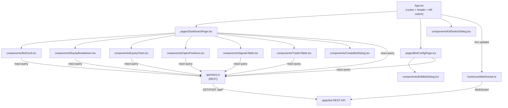

# apps/dashboard

React + Vite frontend: live P&L, trade history, signal/position monitoring, and bot configuration for the `apps/bot` backend.

See the [root README](../../README.md) for the system-wide diagram and setup instructions. This doc covers the dashboard's internal structure.

## Architecture

## Data flow

- **REST reads/writes** — every component that displays or mutates server state goes through `api/client.ts` (typed fetch wrappers) via React Query, hitting `apps/bot`'s `/api/*` routes (trades, equity, positions, signals, bots, reconcile).
- **Live updates** — `hooks/useWebSocket.ts` holds a single WebSocket connection (mounted once, in `App.tsx`) to `apps/bot`'s `ws.ts` server, receiving the same events the backend's internal `EventBus` publishes (`trade.opened`, `trade.closed`, `signal.received`, `balance.updated`, etc.) and invalidating the relevant React Query caches so the UI updates without polling.
- **Routing** — `App.tsx` renders `Header` + `KillSwitchDialog` globally, and switches between `DashboardPage` (`/`) and `BotConfigPage` (`/bots/:id`) via `react-router-dom`.
