# apps/dashboard

React + Vite frontend: live P&L, trade history, signal/position monitoring, and bot configuration for the `apps/bot` backend.

See the [root README](../../README.md) for the system-wide diagram and setup instructions. This doc covers the dashboard's internal structure.

## Architecture

```mermaid
graph TB
    APP["App.tsx<br/>(routes + header + kill-switch)"]
    APP --> DP["pages/DashboardPage.tsx"]
    APP --> TP["pages/TradesPage.tsx<br/>(filter/sort/export)"]
    APP --> BC["pages/BotConfigPage.tsx"]
    APP --> BTP["pages/BacktestPage.tsx<br/>(config + tabs)"]

    DP --> BotCard["components/BotCard.tsx"]
    DP --> EquityBreakdown["components/EquityBreakdown.tsx"]
    DP --> EquityChart["components/EquityChart.tsx"]
    DP --> OpenPositions["components/OpenPositions.tsx"]
    DP --> SignalsTable["components/SignalsTable.tsx"]
    DP --> TradesTable["components/TradesTable.tsx"]
    DP --> StoragePanel["components/StoragePanel.tsx<br/>(DB size, candle/funding row counts,<br/>preview-then-confirm prune)"]
    TradesTable -->|"View all →"| TP
    TP --> Badges["components/tradeBadges.tsx<br/>(shared badges/formatters)"]
    TradesTable --> Badges
    TP --> UISelect["components/ui/Select.tsx"]
    DP --> CreateBotDialog["components/CreateBotDialog.tsx"]
    BC --> EditBotDialog["components/EditBotDialog.tsx"]
    APP --> KillSwitchDialog["components/KillSwitchDialog.tsx"]

    BTP --> BTConfig["components/backtest/BacktestConfig.tsx"]
    BTConfig --> BTOptimize["components/backtest/BacktestOptimizePanel.tsx<br/>(manual param sweep, 1-3 params)"]
    BTP --> BTFinder["components/backtest/StrategyFinderPanel.tsx<br/>(auto search: strategy x symbol x timeframe,<br/>polls a background run, train/validate/holdout<br/>+ optional walk-forward, ranked by validate score)"]
    BTFinder -.->|"Load into backtest"| BTConfig
    BTP --> BTStats["components/backtest/BacktestKeyStats.tsx<br/>(PnL, drawdown, Sharpe/Sortino/Calmar, exposure)"]
    BTP --> BTCompare["components/backtest/BacktestComparisonNotes.tsx<br/>(fill-model / 2x-cost sensitivity callouts,<br/>shown only when requested)"]
    BTP --> BTEquity["components/backtest/BacktestEquityChart.tsx"]
    BTP --> BTTrades["components/backtest/BacktestTradesTable.tsx"]
    BTP --> BTAnalysis["components/backtest/BacktestAnalysis.tsx"]
    BTP --> BTChart["components/backtest/BacktestChart.tsx<br/>(lightweight-charts candles + markers)"]
    BTTrades --> Badges

    BotCard & EquityBreakdown & EquityChart & OpenPositions & SignalsTable & TradesTable & StoragePanel & TP & DP & BC & BTConfig & BTOptimize & BTFinder & BTP & BTChart -->|"react-query"| CLIENT["api/client.ts<br/>(REST)"]
    APP -->|"react-query (shared cache key<br/>with StoragePanel)"| CLIENT
    APP -->|"live updates"| WSHOOK["hooks/useWebSocket.ts"]

    CLIENT -->|"GET/POST /api/*<br/>(same-origin in prod)"| SRV
    WSHOOK -->|"WebSocket<br/>(same-origin in prod)"| SRV["server/createServer.js<br/>(prod only — login page,<br/>session cookie, REST/WS proxy)"]
    SRV -->|"Bearer API_TOKEN,<br/>injected server-side"| BOT["apps/bot REST + WS API"]
```

## Data flow

- **Production server** (`server/createServer.js`, `npm start`) — replaces plain static hosting. It gates every request behind a single-password login (an httpOnly session cookie, no auth library or DB — this is a personal, single-user dashboard), serves the built SPA, and proxies `/api/*` and the WebSocket upgrade to `apps/bot`, injecting the real `API_TOKEN` server-side. This exists because Vite inlines any `VITE_`-prefixed env var into the built JS bundle — shipping the bot's token that way meant anyone who loaded the dashboard URL could extract it and call any bot route directly (including unbounded backtest sweeps) or connect to the bot's WebSocket unauthenticated. In dev (`npm run dev`), the React app instead talks straight to the bot using `VITE_API_URL`/`VITE_API_TOKEN` from `.env.development` — there's no proxy in the loop, which is fine since dev only ever runs on localhost. Those two vars are deliberately kept in a separate `.env.development` file (not the plain `.env` used by `npm start`'s server): Vite loads `.env.development` only in dev mode, never for `npm run build` (production mode by default) — if they lived in `.env` instead, a plain local `npm run build` would silently bake a direct-to-bot URL into the production bundle, and the browser would then try to call the bot cross-origin directly and get blocked, defeating the whole point of the proxy above.
- **REST reads/writes** — every component that displays or mutates server state goes through `api/client.ts` (typed fetch wrappers) via React Query, hitting `apps/bot`'s `/api/*` routes (trades, equity, positions, signals, bots, reconcile) — same-origin through the production server above, or directly in dev.
- **Live updates** — `hooks/useWebSocket.ts` holds a single WebSocket connection (mounted once, in `App.tsx`) to `apps/bot`'s `ws.ts` server (proxied in prod, direct in dev), receiving the same events the backend's internal `EventBus` publishes (`trade.opened`, `trade.closed`, `signal.received`, `balance.updated`, etc.) and invalidating the relevant React Query caches so the UI updates without polling.
- **Routing** — `App.tsx` renders `Header` + `KillSwitchDialog` globally, and switches between `DashboardPage` (`/`), `TradesPage` (`/trades`), and `BotConfigPage` (`/bots/:id`) via `react-router-dom`.
- **Trades page** — `TradesPage` (`/trades`, reached via the header nav or the "View all →" link on the dashboard's `TradesTable`) filters trades by bot/date server-side (`/api/trades` params) and by symbol/side/status/source/search client-side, with column sorting, a filter-aware summary bar, expandable per-trade detail, and CSV export. `tradeBadges.tsx` holds the `pnlSource` badge + formatters shared with `TradesTable`.
- **Backtest page** — `BacktestPage` (`/backtest`) has two modes behind a segmented toggle. **Single backtest** is a data-driven config form (`BacktestConfig`, populated from `/api/backtest/strategies` — also where `maintenanceMarginRate` for the liquidation check, and the `compareFillModel`/`sensitivityCheck` toggles, live) that runs a strategy via `POST /api/backtest/run` and renders the result across four tabs: key stats — PnL, drawdown, Sharpe/Sortino/Calmar, exposure — plus equity-vs-Buy&Hold curve (`BacktestKeyStats` + `BacktestEquityChart`, cloning `EquityChart`'s recharts pattern), a sortable/exportable trade list including funding cost and MAE/MFE per trade (`BacktestTradesTable`, reusing `tradeBadges.tsx`), returns/win-rate/expectancy/exit-reason/monthly-return analysis (`BacktestAnalysis`), and a candlestick chart with entry/exit markers (`BacktestChart`, the dashboard's only non-recharts chart — uses `lightweight-charts`, lazy-fetching windowed OHLC from `/api/backtest/candles`); `BacktestComparisonNotes` renders the fill-model/sensitivity-check callouts when the run requested them. The last run's config + result persist to `localStorage` so an accidental refresh doesn't lose them (Strategy Finder already has full server-side history for its own use case, via `OptimizationRun`, so this is deliberately just a single-slot convenience, not a second history mechanism). The page also has an inline manual param sweep (`BacktestOptimizePanel`, 1-3 params, ranked by raw PnL%) via `POST /api/backtest/optimize`. **Strategy Finder** (`StrategyFinderPanel`) is the automated counterpart: pick symbols/timeframes/strategies, optionally enable walk-forward selection, start a background search via `POST /api/backtest/optimize/auto`, and poll `GET /api/backtest/optimize/auto/:runId` (React Query `refetchInterval`, active only while the run's `status` is `"running"`) for progress and a results table ranked by validate score, with train/validate/holdout columns and a Fit % badge (holdout ÷ train score) per row — a persistent legend above the table explains what each split means, since holdout is the only genuinely trustworthy number and that's easy to miss at a glance. Its "Load" action hands the chosen strategy/params/symbol/timeframe to `BacktestConfig` (a `prefill` prop keyed by an incrementing token, applied by adjusting state during render rather than via an effect) and switches back to the Single backtest tab.
- **Storage panel** — `StoragePanel` (on the dashboard home page) polls `GET /api/storage/stats` for total DB file size against the configured Railway Volume ceiling, plus row counts and date coverage for the `Candle`/`FundingRate` backtest cache (the two tables that grow unbounded — every new symbol/timeframe/date-range backtested adds rows, with nothing pruning it otherwise, on a volume shared with live trading data). Its prune form is preview-then-confirm: a first request without `confirm=true` returns counts only, and a second, explicit "Confirm delete" click actually deletes — mirroring the existing `DELETE /api/reset-trade-data` dry-run pattern so a delete is never one click. `App.tsx` polls the same query key (react-query dedupes it into one request) and shows a persistent banner app-wide once usage crosses the backend's critical threshold, so the warning isn't only visible to someone already on the dashboard's home page.
